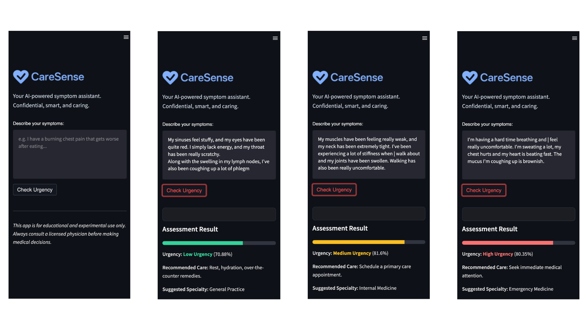

# CareSense

[](https://www.python.org)  [](https://scikit-learn.org)  [](https://streamlit.io)  [](https://github.com/tesseract-ocr/tesseract)  [](LICENSE)  [](https://nessakodo.com)

---

## Project Overview

CareSense is an AI-powered symptom triage assistant that helps users determine the urgency of their symptoms before visiting a healthcare provider. By using real patient data and natural language processing, it offers immediate feedback, care guidance, and specialist recommendations.

---

## Problem

Many people delay care or misuse emergency services due to confusion or lack of access to accurate medical triage. This can lead to worsened conditions, overcrowded ERs, and lost time for both patients and providers.

---

## Solution

CareSense classifies free-text symptom descriptions into urgency levels—low, medium, or high—and provides actionable insights based on symptom context and frequency.

---

## Features

- Accepts natural language symptom descriptions  
- Returns urgency level with confidence scores  
- Suggests care guidance and medical specialty  
- Tracks previously entered symptoms and flags recurring issues  
- Optional OCR mode for extracting symptoms from image-based reports

---

## How to Run Locally

1. **Install dependencies**

```bash
pip install -r requirements.txt
```

2. **Extract data (optional if already extracted)**

```bash
python ocr_extract.py
```

3. **Train the model**

```bash
python train_model.py
```

4. **Run the app**

```bash
python -m streamlit run app.py
```

---

## Windows-Specific Setup Notes

If using OCR (image-based input):

- Install [Tesseract for Windows](https://github.com/tesseract-ocr/tesseract)  
- Add the path to `tesseract.exe` to your system `PATH` (e.g. `C:\Program Files\Tesseract-OCR\tesseract.exe`)
- Confirm installation:

```bash
tesseract --version
```

---

## Demo

### Test Prompts

My sinuses feel stuffy, and my eyes have been quite red. |
simply lack energy, and my throat has been really scratchy.
Along with the swelling in my lymph nodes, I've also been
coughing up a lot of phlegm

My muscles have been feeling really weak, and my neck has been extremely tight. I've been experiencing a lot of stiffness when | walk about and my joints have been swollen. Walking has also been really uncomfortable.

I'm having a hard time breathing and | feel really uncomfortable. I'm sweating a lot, my chest hurts and my heart is beating fast. The mucus I'm coughing up is brownish.




---

## Credits

CareSense was built during AurariaHack 2025 at CU Denver.

---
